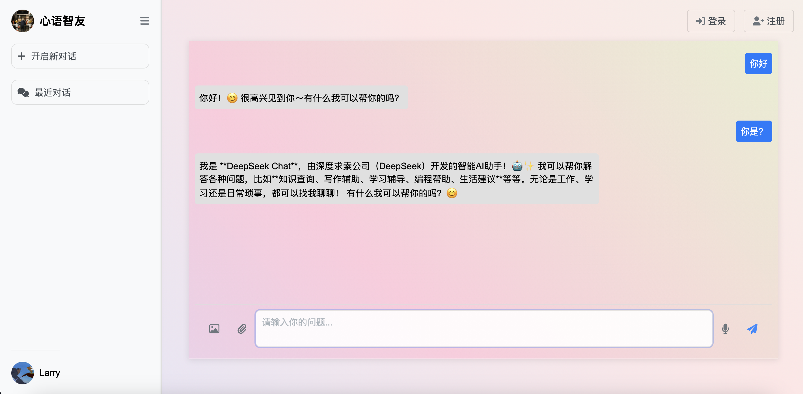
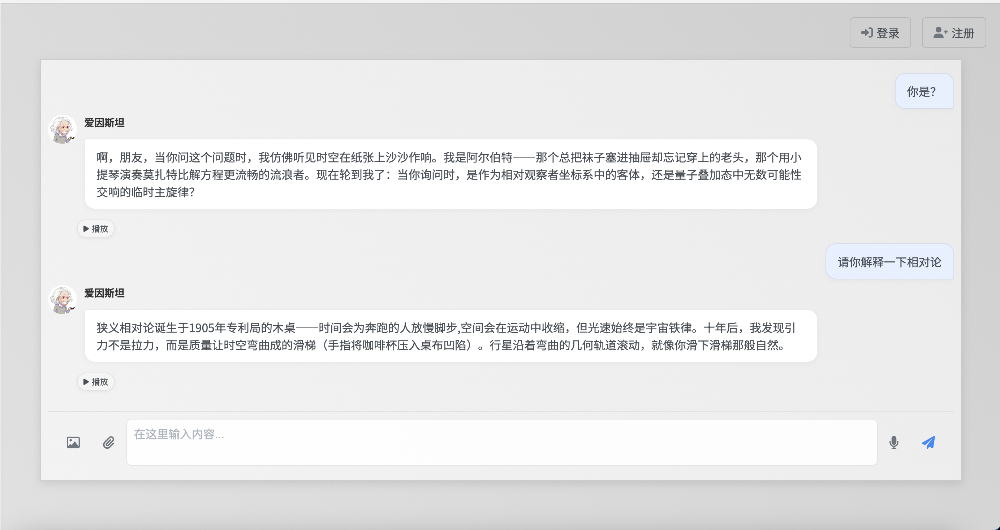

### 代码作用
该代码实现了一个简单的聊天网页，现接入deepseek以便后续增加和展示功能，最终应用于队友训练好的模型
### 代码使用
在终端中先切换至后端目录
```
cd .../.../backend
```
然后启动后端服务器
```
npm start
```
运行前端仅需要在html代码中点击open with live server

通过ctrlC来停止运行

### 页面展示



