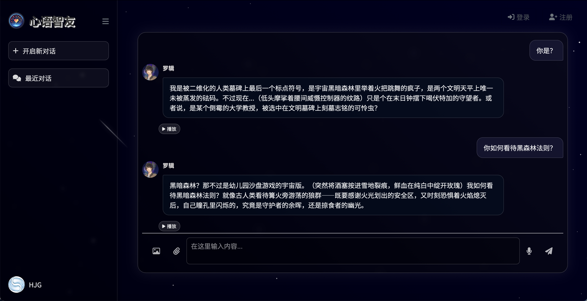

> 最初是一个前端网页与deepseek接入用于测试，后续又实现了不同的场景，用于不同人物的对话等模拟，或者不同系统的前端展示界面。我发现他的应用场景可以一直拓展，只需要做简单的改动即可。经过调研，该页面只使用html，css，js三件套，对于初学者来说很简单就可以实现效果较为不错的页面展示，后续打算将它应用为一个模板，方便简单的AI修改就可以快速用于你的前端展示页面

### 代码简介
通过前端实现了一个简单的聊天网页，Chatbot_dpsk接入了deepseek可以进行问答，chat， chat2根据不同的对话人物，设计不同的界面风格。代码用于调整测试布局外观，以便后续增加和展示功能，最终应用于已训练好的模型，实现真正的丰富多彩的聊天网页，让用户沉浸式体验与不同真实/虚拟人物对话的乐趣
### 如何运行
在终端中先切换至后端目录
```
cd .../Chatbot_dpsk/backend
```
然后启动后端服务器
```
npm start
```
运行前端需要在html页面代码中右键打开 live server 插件

通过ctrlC来停止运行

### 页面展示





